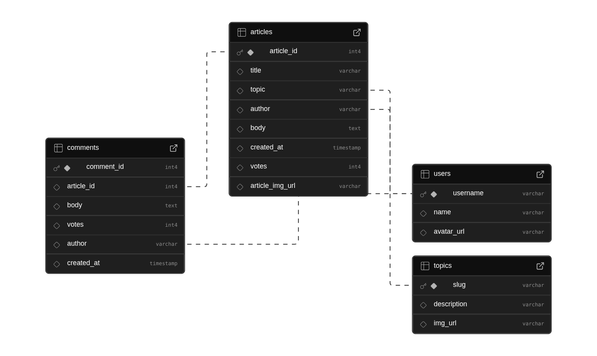

<p align="center"><a href="https://git.io/typing-svg"></a></p>

<div align="center">
  
[](https://github.com/PhoneSettPaing/be_nc_news/actions/workflows/test-and-deploy.yml)

</div>

# 📰 Northcoders News API

A RESTful backend API for a Reddit-style news site. Built with **Node.js**, **Express**, and **PostgreSQL**, it allows users to fetch, create, update, and delete articles, topics, comments, and users — with full pagination, sorting, filtering, and robust error handling.

This project was built as part of the **Northcoders Bootcamp Course** to demonstrate skills in backend development, RESTful architecture, and test-driven development.

<br/>

## 📖 Table of Contents

- [📰 Northcoders News API](#-northcoders-news-api)
  - [📖 Table of Contents](#-table-of-contents)
  - [🚀 Live Demo](#-live-demo)
  - [📋 Features](#-features)
  - [🛠️ Tech Stack](#️-tech-stack)
  - [📦 Architecture](#-architecture)
  - [📂 Database Schema](#-database-schema)
  - [✅ Getting Started](#-getting-started)
    - [🔧 Prerequisites](#-prerequisites)
    - [🛠 Installation \& Setup](#-installation--setup)
  - [🧪 Running Tests](#-running-tests)
  - [📖 API Documentation](#-api-documentation)
    - [🔑 Core API Endpoints](#-core-api-endpoints)

<br />

## 🚀 Live Demo

👉 [Access the Live API on Render](https://nc-news-qonp.onrender.com/api)

Use `/api` to view all available endpoints.

<br/>

## 📋 Features

- 📰 View articles, topics, users, and comments
- 🔍 Filter and sort articles by query (`sort_by`, `order`, `topic`)
- 📄 Pagination support via `limit` and `p`
- ✍️ Post new articles, topics, and comments
- ⬆️ Update votes on articles and comments
- 🗑 Delete comments and articles
- 🚫 Full error handling for:
  - Invalid or missing parameters
  - Non-existent routes or resources
  - SQL and data validation errors

<br/>

## 🛠️ Tech Stack

<p align="left"> <a href="https://github.com/alexandresanlim/Badges4-README.md-Profile" ></a> <a href="https://github.com/alexandresanlim/Badges4-README.md-Profile" ></a> <a href="https://github.com/alexandresanlim/Badges4-README.md-Profile" ></a> <a href="https://badges.pages.dev/" ></a> <a href="https://github.com/alexandresanlim/Badges4-README.md-Profile" ></a> <a href="https://github.com/alexandresanlim/Badges4-README.md-Profile" ></a> <a href="https://github.com/alexandresanlim/Badges4-README.md-Profile" ></a> <a href="https://github.com/alexandresanlim/Badges4-README.md-Profile" ></a> <a href="https://github.com/alexandresanlim/Badges4-README.md-Profile" ></a> <a href="https://github.com/alexandresanlim/Badges4-README.md-Profile" ></a> <a href="https://github.com/alexandresanlim/Badges4-README.md-Profile" ></a> </p>

<br/>

## 📦 Architecture

- **MVC pattern** (Models, Controllers, Routers)
- Centralized error handling
- Environment-specific configuration using `.env` files
- Separate databases for development and test environments

<br/>

## 📂 Database Schema



The database includes tables for users, topics, articles, and comments with appropriate foreign key relationships and cascading deletes where applicable.

<br/>

## ✅ Getting Started

### 🔧 Prerequisites

- **Node.js**: v23.9.0 or higher
- **PostgreSQL**: v15 or higher

### 🛠 Installation & Setup

1. **Clone this repository**

   ```bash
   git clone https://github.com/PhoneSettPaing/be_nc_news.git
   cd be-nc-news
   ```

2. **Install dependencies**

   ```bash
   npm install
   ```

3. **Set up environment variables**

   Create two `.env` files in the root directory:

   For development: **`.env.development`**

   ```
   PGDATABASE=nc_news
   ```

   For testing: **`.env.test`**

   ```
   PGDATABASE=nc_news_test
   ```

4. **Create and seed your databases**

   ```bash
   npm run setup-dbs
   npm run seed-dev
   ```

5. **Start the server locally**
   ```bash
   npm start
   ```

<br/>

## 🧪 Running Tests

Run all test suites using Jest and Supertest:

```bash
npm test
```

Tests include:

- ✅ Successful endpoints
- ❌ Error handling (invalid input, bad routes, PSQL violations, etc.)

<br/>

## 📖 API Documentation

Once deployed or running locally, navigate to:

```
GET /api
```

This returns a full JSON object documenting all available endpoints, queries, and example responses.

Alternatively, refer to the included [`endpoints.json`](./endpoints.json) file.

### 🔑 Core API Endpoints

| Method | Endpoint                             | Description                                                          |
| ------ | ------------------------------------ | -------------------------------------------------------------------- |
| ALL    | `/*url`                              | Catch all invalid URLs and return 404 Not Found error                |
| GET    | `/api`                               | Returns JSON of all available endpoints                              |
| GET    | `/api/topics`                        | Get all topics                                                       |
| POST   | `/api/topics`                        | Insert a topic                                                       |
| GET    | `/api/articles`                      | Get all articles (supports queries: sort_by, order, topic, limit, p) |
| POST   | `/api/articles`                      | Insert a new article                                                 |
| GET    | `/api/articles/:article_id`          | Get a single article by article_id                                   |
| PATCH  | `/api/articles/:article_id`          | Update article votes by article_id                                   |
| DELETE | `/api/articles/:article_id`          | Delete an article by article_id                                      |
| GET    | `/api/articles/:article_id/comments` | Get comments for a specific article (supports queries: limit, p)     |
| POST   | `/api/articles/:article_id/comments` | Add a comment to a specific article                                  |
| PATCH  | `/api/comments/:comment_id`          | Update votes for a comment by comment_id                             |
| DELETE | `/api/comments/:comment_id`          | Delete a comment by comment_id                                       |
| GET    | `/api/users`                         | Get all users                                                        |
| GET    | `/api/users/:username`               | Get a single user by username                                        |

---

This project was built as part of the **Software Development Bootcamp in JavaScript** course provided by [**Northcoders**](https://www.northcoders.com/).
